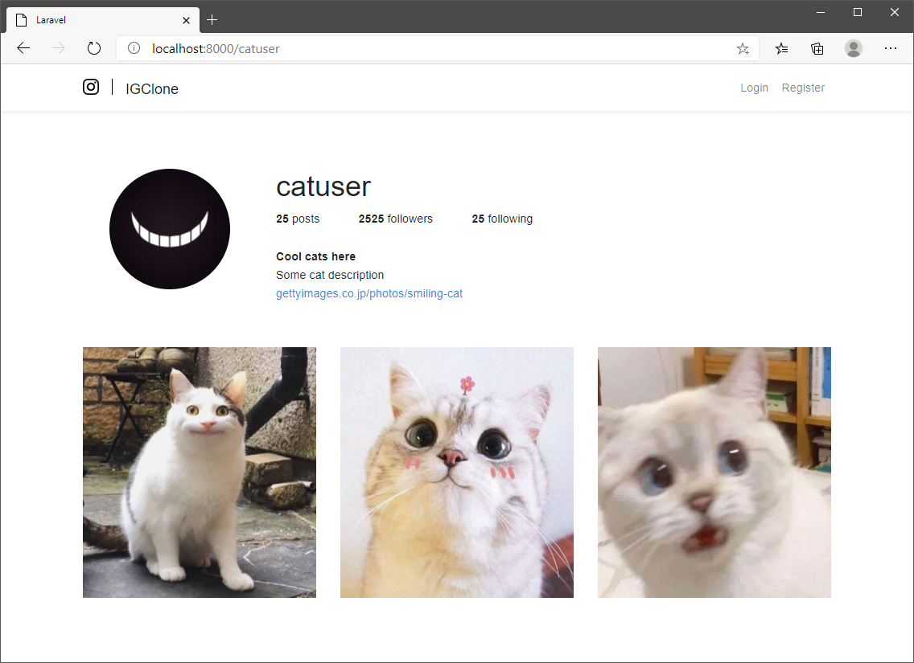
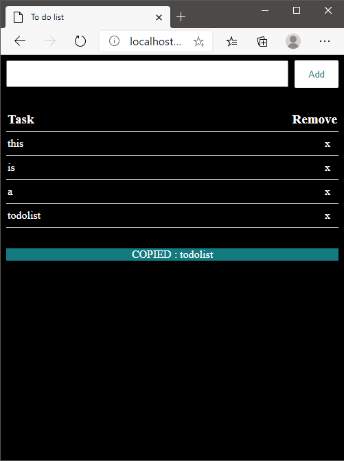
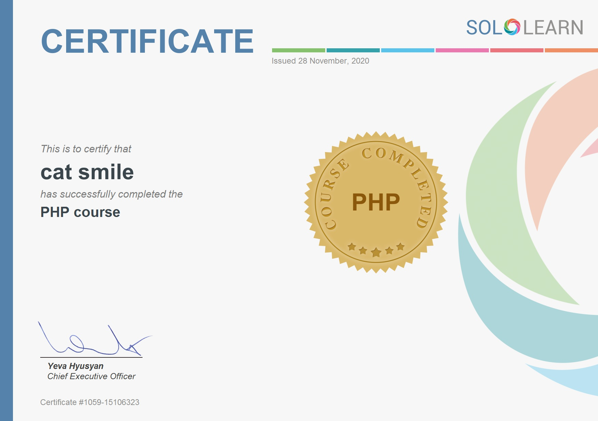

# Environment
WSL, VSCode, Nodejs, Terminal installation (Nodejs - for Laravel projects only)  
 > https://github.com/catsmile-nico/Nodejs-Practice  

Apache, Mysql, PHP installation
 > https://medium.com/@fiqriismail/how-to-setup-apache-mysql-and-php-in-linux-subsystem-for-windows-10-e03e67afe6ee, https://websiteforstudents.com/install-phpmyadmin-on-ubuntu-20-04-18-04-with-apache/  

Laravel Environment installation (Laravel projects only)  
 > https://getcomposer.org/download/  // refer to Command-line installation  
 > https://getcomposer.org/doc/00-intro.md#globally  // refer to globally  
 > https://laravel.com/docs/8.x/installation  

## Environment Fixes
[FIXES.txt](FIXES.txt)  

## Cheatsheets
[LARAVEL](LARAVEL.txt)  

# Development (laravel)
1) Launch development env - Launch Terminal > "wsl" > "cd {project directory}" > "code ."  
2) Start services - (In Terminal) php artisan serve  
3) Launch localhost - Step 2 output  
4) Edit code  

## IGClone (laravel)
 

```
Description : Instagram clone using laravel framework
Functions : Login, TBD
```

# Development (non-laravel)
1) Launch development env - Launch Terminal > "wsl" > "cd {project directory}" > "code ."  
2) Start services - (In Terminal) sudo service apache2 start && sudo service mysql start  
3) Launch localhost - Browser > localhost/{projectName}  
4) Edit code  

## TODOList (non-laravel)
 

```
Functions: Add/Remove task, click to copy task contents
```

# Courses & References
 

```
SoloLearn is an online and mobile learning platform that allows users to learn a variety of programming languages and concepts through short lessons, code challenges, and quizzes.
```
